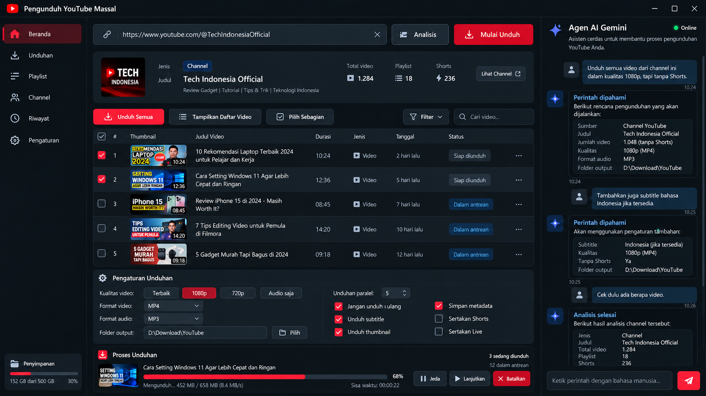

# MASTER PLAN SOL — UI Pengunduh YouTube Massal

Tanggal: 28 September 2026. Audit kode dasar: `ab12c151f7975a54091b0e93df1c43d6201c447c`.
Status dokumen: rencana implementasi, bukan laporan GUI selesai.

## 1. Mandat pengguna dan sumber desain

Pengguna meminta UI **sama persis dengan gambar referensi**, seluruh antarmuka berbahasa Indonesia. Astra hanya menyusun rencana; Sol melaksanakan implementasi. Jadikan gambar berikut sumber visual utama, bukan inspirasi bebas:



File referensi asli: `docs/reference/youtube-bulk-downloader-id.png`, ukuran **1672 × 941 px**. Gambar disimpan utuh tanpa rekonstruksi. Gambar mengalahkan perkiraan ukuran/token dalam dokumen ini jika terdapat selisih. Jangan mengganti desain menjadi dashboard web, kartu besar, tema ungu, atau susunan panel berbeda. Bangun kontrol native yang benar-benar interaktif, jangan menaruh screenshot sebagai latar aplikasi.

Nama tampilan: **Pengunduh YouTube Massal**. Panel kanan: **Agen AI Gemini**. Target Windows portable: ekstrak ZIP lalu jalankan EXE tanpa instal Python dan tanpa admin. Pertahankan CLI yang sudah ada. Tidak perlu migrasi framework, website, atau membawa repository GUI lain secara keseluruhan; PySide6 sudah ditetapkan oleh README. Jika mengambil kode/aset pihak lain, bawa lisensi/atribusi yang diperlukan.

## 2. Hasil audit repository

| Lokasi yang sudah ada | Temuan terverifikasi | Pekerjaan Sol |
|---|---|---|
| `main.py` | CLI argparse, perintah wajib; hanya analyze/download mempunyai executor | Tambahkan jalur GUI tanpa argumen; CLI lama tetap berjalan |
| `pyproject.toml` | Python >=3.11; PySide6 baru dependency opsional `gui` | Aktifkan instalasi GUI dan konfigurasi build portable |
| `app/models/commands.py` | DownloadIntent berisi format, kualitas, flags, folder, paralel 1–10 | Pertahankan validasi; tambah model item, antrean, state aplikasi dan perubahan intent parsial |
| `app/core/downloader.py::analyze` | Hanya menghasilkan id/title/url; `entry_count` menggunakan len(entries), kosong dianggap satu | Normalisasi video/playlist/channel, pagination/batch, metadata tabel dan hitungan yang jujur |
| `app/core/downloader.py::download` | Satu pemanggilan unduh URL; belum ada events/progres GUI | Bungkus sebagai pekerjaan per video, hooks progress/postprocess, pembatalan, riwayat |
| `concurrent_fragment_downloads` | Menerima `intent.concurrent_downloads` | Pisahkan jumlah video paralel dari jumlah fragmen per video |
| `app/ai/gemini_agent.py` | Parser Gemini + fallback lokal, maksimal 100 key, current_url | Hubungkan chat secara asinkron; tambah konteks pengaturan dan intent parsial |
| struktur repository | Belum ada GUI, aset, tests, antrean persisten, atau workflow build | Tambahkan modul sesuai urutan di bawah |

Risiko konkret yang harus masuk integrasi, bukan klaim sudah diperbaiki:

- Fallback `use_archive` menjadi false saat teks mengandung `download ulang`, termasuk kalimat **jangan download ulang**. Utamakan negasi; uji kalimat ini.
- Fallback menyalakan subtitle pada **jangan unduh subtitle** karena pencocokan kata positif. Terapkan negasi sebelum kata positif.
- Permintaan lanjutan seperti **tambahkan subtitle Indonesia** menghasilkan intent baru dengan nilai default sehingga berisiko menghapus pilihan 1080p/tanpa Shorts. Gunakan patch field yang eksplisit, bukan overwrite seluruh form.
- Filter Shorts hanya mengecek `/shorts/` pada URL; URL watch biasa tidak cukup. Gunakan sumber tab/metadata yang dapat dipercaya; durasi pendek saja tidak membuktikan Shorts. Bedakan hasil belum terklasifikasi.
- Flat extraction channel dapat mengembalikan tab/playlist bersarang; jangan menampilkan tab sebagai video atau menganggap semua field sudah lengkap.
- `best[height<=...]/best` memungkinkan fallback melampaui resolusi pilihan. Tegaskan pilihan 1080p sebagai maksimum, beri kegagalan/opsi alternatif yang jelas ketika format sesuai tidak tersedia.
- Return code dan `ignoreerrors=True` belum cukup untuk menyatakan tiap video berhasil; hasil per pekerjaan harus eksplisit dan progres 100% jaringan belum berarti merge selesai.
- `GEMINI_MODEL` saat ini default `gemini-3.8-flash`; nama itu belum divalidasi dalam audit ini. Sol wajib memverifikasi model yang benar-benar tersedia melalui sumber resmi saat implementasi. Buat model dapat dikonfigurasi dan fallback lokal tetap berfungsi.

## 3. Peta geometri desain

Semua koordinat di bawah perkiraan hasil membaca gambar asli dalam piksel pada 100% DPI. Gunakan layout Qt, bukan posisi absolut untuk seluruh aplikasi. Pengukuran menjadi patokan screenshot 1672 × 941; ukuran jendela lain menyesuaikan.

| Area | x / y / lebar / tinggi perkiraan | Isi dan perilaku visual |
|---|---|---|
| Title bar | 0 / 0 / 1672 / 40 | Ikon merah play, judul putih kiri; minimize, maximize, close kanan |
| Sidebar | 0 / 40 / 205 / 901 | 6 menu; kartu penyimpanan menempel bawah |
| Workspace tengah | 205 / 40 / 1076 / 901 | Margin horizontal sekitar 15; seluruh blok sejajar |
| Panel Gemini | 1281 / 40 / 391 / 901 | Border kiri, header, chat scroll, composer menetap bawah |
| Toolbar URL | 220 / 57 / 1044 / 50 | Input sampai x916, Analisis x927–1063, Mulai Unduh x1075–1263 |
| Ringkasan sumber | 220 / 122 / 1044 / 123 | Avatar kiri, jenis/judul/deskripsi, statistik, Lihat Channel |
| Toolbar daftar | 220 / 259 / 1044 / 38 | Unduh Semua, Tampilkan Daftar Video, Pilih Sebagian; Filter dan Cari video |
| Tabel | 220 / 306 / 1044 / 328 | Header ±35 px; 5 baris contoh ±58 px |
| Pengaturan Unduhan | 220 / 641 / 1044 / 176 | Dua kolom, pemisah vertikal; judul dengan gear |
| Proses Unduhan | 220 / 823 / 1044 / 110 | Thumbnail, judul, progress merah, angka dan tombol kanan |
| Composer AI | 1295 / 882 / 363 / 45 | Input lebar ±297 dan tombol kirim merah ±54 |

Proporsi panel di baseline sekitar 12,3% / 64,4% / 23,4%. Sidebar nominal 205 logical px dan AI 391 logical px; tengah mengambil sisa. Gunakan QSplitter dengan batas minimum dan posisi awal sesuai referensi; simpan pilihan pengguna. Pada layar kecil izinkan scroll vertikal workspace, horizontal tabel bila perlu, dan panel AI dapat diperkecil/disembunyikan melalui kontrol tambahan yang tidak mengganggu baseline. Jangan sembunyikan AI pada screenshot baseline. Form tidak boleh tumpang tindih dengan progress.

Windows 1366 × 768 pada skala 125% mempunyai ruang logical lebih kecil daripada 1366 × 768. Jangan memaksakan minimum window sebesar baseline. Uji work area nyata; compact mode dan scroll tetap menjangkau semua kontrol. Jangan mengecilkan seluruh aplikasi sebagai bitmap. Title bar kustom harus mendukung drag, double click maximize/restore, resize, snapping Windows dan Alt+F4.

## 4. Warna, font, ikon dan bentuk

Sampel warna dari beberapa piksel gambar: latar `#0A1216`, sidebar `#0C141B`, panel `#141D26`, input `#1B2732`, header tabel `#12202A`, merah tombol sekitar `#D60B25`. Gambar memiliki gradasi; nilai tersebut bukan warna rata seluruh elemen.

Token awal untuk dicocokkan kembali secara visual:

| Token | Nilai awal |
|---|---|
| window/sidebar | `#0A1216` / `#0C141B` |
| panel/input/border | `#141D26` / `#1B2732` / `#2B3D4B` |
| primary/primary-hover | `#FF1437` / `#FF3652` |
| text/text-secondary | `#F3F5F7` / `#ADBECD` |
| selected-nav | gradasi marun `#50141E` menuju `#38131B` |
| queued badge | latar biru gelap `#073454`, teks cyan `#47BAFF` |
| online | `#00D880` dengan glow sangat ringan |

Font awal Segoe UI pada Windows; judul utama 17–18 px semibold, judul panel 15–16 px, isi 13–14 px, metadata 12 px. Samakan x-height/weight dengan referensi melalui screenshot; jangan gunakan font besar 18 px untuk tabel. Radius panel/input 7–10 px, border tipis 1 px, padding rapat. Bayangan halus, tanpa neon berlebihan.

Ikon: SVG garis konsisten, sekitar 18–22 px; merah untuk home aktif dan unduhan, biru untuk kilau Gemini. Gunakan SVG/aset berlisensi atau path vector buatan sendiri. Jangan memakai emoji sebagai ikon UI karena bentuknya berubah antar Windows. Kolom thumbnail sekitar 133 × 49 px, crop cover dan radius kecil, badge durasi kanan bawah. Jangan membekukan tulisan atau thumbnail referensi menjadi data runtime.

## 5. Kontrak komponen dan interaksi

### Sidebar dan halaman

Urutan persis: **Beranda, Unduhan, Playlist, Channel, Riwayat, Pengaturan**. Beranda aktif dengan latar marun dan garis merah kiri. Penyimpanan bawah memakai volume folder output aktif: kapasitas terpakai/total dan persentase, bukan angka contoh 152/500 GB. Label kapasitas memperjelas bahwa ini penggunaan disk, bukan ukuran antrean.

Beranda mengikuti referensi. Unduhan menampilkan pekerjaan aktif/tertunda/gagal; Playlist dan Channel menampilkan sumber tersimpan sesuai jenis; Riwayat hanya hasil aktual; Pengaturan memuat API key, model, lokasi tools dan pengaturan aplikasi. Halaman tambahan mengikuti token yang sama; tidak ada desain halaman tambahan yang bisa diklaim berasal dari screenshot.

### URL dan kartu sumber

- Placeholder URL dalam Bahasa Indonesia, ikon tautan kiri dan clear kanan. Enter menjalankan Analisis. Tampilkan loading dan error di tempat tanpa menggeser susunan secara besar.
- **Analisis** hanya membaca metadata. URL kosong/tidak valid menghasilkan pesan lokal. Validasi scheme/host Youtube dan ID sebelum executor; metadata asing diperlakukan sebagai teks, bukan instruksi AI.
- **Mulai Unduh** menjalankan pilihan yang sudah disiapkan. Bila belum dianalisis, analisis lebih dulu dan tampilkan ringkasan pilihan; jangan mengarang daftar.
- Kartu sumber: avatar, label Jenis, badge Channel/Playlist/Video, Judul, deskripsi singkat, Total video, Playlist, Shorts, Lihat Channel. Adaptasi field untuk satu video/playlist tanpa statistik palsu.
- Hitungan belum tersedia ditampilkan `—` atau `Memuat…`; bedakan jumlah terdeteksi dan jumlah yang dipilih setelah filter. Playlist adalah jumlah playlist, bukan jumlah video playlist. Jangan mengurangi dua hitungan yang mungkin bertumpang tindih tanpa normalisasi ID.

### Toolbar dan tabel

- **Unduh Semua** membuat antrean semua item yang lolos aturan sumber/Shorts/Live; filter pencarian hanya mengubah tampilan, tidak diam-diam membatasi sumber. Tampilkan jumlah yang akan diproses sebelum commit ke antrean.
- **Tampilkan Daftar Video** memuat/menampilkan hasil analisis, dengan indikator pekerjaan yang sedang berjalan.
- **Pilih Sebagian** mengaktifkan mode seleksi; **Mulai Unduh** memakai selected_ids. Checkbox header tri-state berlaku pada baris hasil filter yang sedang ditampilkan; pilihan tersembunyi tetap dipertahankan dan jumlah pilihan selalu terlihat.
- **Filter** menyediakan jenis/status/tanggal sesuai metadata tersedia; search judul case-insensitive. Jangan mengubah pilihan pengguna karena sorting.
- Kolom: checkbox, `#`, Thumbnail, Judul Video, Durasi, Jenis, Tanggal, Status, menu `…`. Nomor tampilan boleh berubah; identitas pekerjaan tetap video ID + profil unduhan.
- Gunakan QTableView + QAbstractTableModel + delegate thumbnail/status, bukan ribuan QWidget per baris. Virtualisasi dan lazy thumbnail, cache bounded, fallback gambar kosong.
- Judul maksimal 2 baris, tooltip lengkap. Tanggal relatif seperti `2 hari lalu` dengan tooltip tanggal tepat; unknown bukan `hari ini`.
- Badge contoh: Siap diunduh abu, Dalam antrean biru. Tambahkan Mengunduh, Menggabungkan, Dijeda, Selesai, Gagal, Dibatalkan, Dilewati dengan gaya konsisten. Menu baris: unduh/coba lagi, buka sumber, buka folder hasil bila ada, hapus dari antrean sesuai state.

### Pengaturan unduhan

Kiri: Kualitas video [Terbaik] [1080p] [720p] [Audio saja]; Format video dropdown MP4/MKV/WebM; Format audio MP3/M4A/Opus/Terbaik; Folder output + **Pilih**.

Kanan: **Unduhan paralel** spinbox 1–10; **Jangan unduh ulang**, **Unduh subtitle**, **Unduh thumbnail**, **Simpan metadata**, **Sertakan Shorts**, **Sertakan Live**.

- Mode Audio saja menonaktifkan pilihan video yang tidak relevan dan menggunakan audio_format. Format audio pada mode video tidak berarti otomatis membuat MP3 terpisah; jelaskan via tooltip, jangan mengunduh audio ganda tanpa permintaan.
- Memilih MP4 memerlukan format codec/container kompatibel; `merge_output_format` saja tidak menjamin semua kombinasi bisa digabung. Nyatakan fallback atau kebutuhan konversi secara jujur.
- Subtitle Indonesia bila tersedia, tidak menjanjikan terjemahan otomatis. Tambah opsi bahasa melalui pengaturan sekunder; urutan manual/otomatis jelas.
- Tetapkan default GUI yang mengikuti pilihan gambar: 1080p, MP4, MP3, paralel 5, archive/subtitle/thumbnail/metadata aktif, Shorts/Live nonaktif. CLI legacy tidak perlu diam-diam diubah. Snapshot intent tiap pekerjaan agar perubahan form tidak mengubah pekerjaan aktif.
- Folder awal portable-relative `downloads`, bukan hardcode drive D: dari mockup. Simpan pilihan nyata pengguna dan tampilkan path absolut hasil resolusi.

### Progress dan kontrol antrean

Bagian bawah: thumbnail pekerjaan fokus, judul, progress merah, persen, `Mengunduh… X MB / Y MB (Z MB/s)`, Sisa waktu, hitungan sedang unduh/dalam antrean, **Jeda**, **Lanjutkan**, **Batalkan**. Pada paralel, tampilkan satu pekerjaan fokus dan akses semua pekerjaan di halaman Unduhan; persentase pekerjaan dan total antrean jangan dicampur.

State minimum: ready → queued → downloading → postprocessing → completed, ditambah pausing/paused/cancelled/failed/skipped. Tombol disabled sesuai state. Ukuran/ETA belum diketahui memakai progress indeterminate dan `—`; saat FFmpeg bekerja tampilkan Menggabungkan/Mengonversi.

Jeda berlaku antrean: hentikan penjadwalan pekerjaan baru, hentikan proses unduh secara terkontrol dan pertahankan `.part`; Lanjutkan menjadwalkan ulang dengan resume bila server mendukung. Jangan mengklaim semua protokol bisa resume byte-perfect. Jika sedang merge, tuntaskan merge atau tangani penghentian dan cleanup secara eksplisit; status Jeda baru muncul setelah benar-benar berhenti. Batalkan hanya job/proses milik aplikasi, tanpa menghapus file hasil selesai. Gunakan process group/child process management yang kompatibel Windows; jangan menghentikan FFmpeg aplikasi lain.

### Panel Agen AI Gemini

Header kilau biru, nama dan status, deskripsi dua baris. Chat user biru gelap kanan, avatar kotak; jawaban AI gelap berborder dengan heading cyan dan tabel key/value. Timestamp kecil. Chat scroll sendiri; composer tetap di bawah, Enter kirim dan Shift+Enter baris baru. Autoscroll hanya jika pengguna berada dekat pesan terakhir.

Status Online hanya berdasarkan koneksi/permintaan sukses yang diketahui; selain itu Belum dikonfigurasi, Menghubungkan, Mode lokal, atau Gangguan. Jangan selalu memberi titik hijau.

Alur: bahasa manusia → validated intent/patch → ringkasan sumber + jumlah + kualitas + folder + filter → terapkan ke shared state → executor lokal. **Cek dulu berapa video** tidak mengunduh. **Tambahkan juga subtitle bahasa Indonesia jika tersedia** mengubah subtitle saja. Perintah jeda/lanjut/batal menggunakan queue controller yang sama dengan tombol GUI.

Gunakan preview **Perintah dipahami** seperti gambar; saat sumber/jumlah belum jelas jangan mulai batch besar secara diam-diam. Terapkan perilaku preview sebelum eksekusi yang telah ditetapkan README. Tampilkan **Mulai Unduh** sebagai aksi untuk rencana baru; permintaan yang jelas pada antrean aktif bisa langsung jeda/lanjut sesuai intent. Pengaturan AI dan manual harus tersinkron dua arah. API key tidak boleh muncul di chat/log/screenshot; tampilkan key dengan masking dan simpan konfigurasi di luar git. Rotasi key tetap bounded dengan timeout/cooldown, tidak loop tak terbatas; tangani kuota sesuai ketentuan penyedia.

## 6. Struktur implementasi yang diusulkan

Nama file berikut usulan baru, bukan file yang sudah ada. Hindari satu MainWindow ribuan baris.

```text
app/gui/bootstrap.py                QApplication dan launch GUI
app/gui/main_window.py              shell tiga kolom dan title bar
app/gui/theme.py                    tokens dan stylesheet
app/gui/widgets/                    sidebar, source card, settings, progress, chat
app/gui/pages/                      halaman sidebar
app/gui/models/video_table_model.py QAbstractTableModel
app/gui/delegates/                  thumbnail, judul, badge
app/controllers/app_controller.py   aksi UI, AI, selection, shared state
app/models/state.py                AppState, SourceInfo, VideoItem, DownloadJob
app/models/intent_patch.py          patch eksplisit untuk percakapan berlanjut
app/core/source_service.py         ekstraksi bertahap dan normalisasi sumber
app/core/queue_manager.py          scheduling, state, dedup, pause/resume/cancel
app/core/download_worker.py        proses yt-dlp dan events terstruktur
app/core/storage.py                queue/history/config persisten
app/core/paths.py                  portable paths dan tools
app/assets/icons/                 SVG/resources paket
tests/                            regresi fungsional penting
tests/fixtures/ui_reference/       data deterministik untuk screenshot
scripts/build_windows.ps1          build folder portable
packaging/                        spec PyInstaller onedir
.github/workflows/windows.yml      uji dan build ZIP Windows
```

GUI thread hanya untuk painting/slot singkat. Analisis, thumbnail, Gemini dan download berjalan di worker; signals/slots membawa hasil ke GUI. Setiap analisis memakai request ID agar hasil URL lama tidak menggantikan URL baru. Download worker proses terisolasi memberi event started/progress/postprocess/completed/failed/cancelled; kontrol queue tidak blocking UI. Batasi update progres sekitar 5–10 kali/detik, dan batch insert metadata.

Untuk persistence pilih SQLite untuk queue/history dan JSON tervalidasi untuk setting nonsecret; implementasi sederhana diperbolehkan selama atomic dan recovery teruji. Pada restart, pekerjaan yang tadinya berjalan menjadi dapat dilanjutkan, bukan otomatis selesai. Archive tulis terkoordinasi di manager: hindari worker paralel merusak file archive bersama. Riwayat unduh tidak menghalangi permintaan eksplisit kualitas/format berbeda. Simpan status profil serta lokasi file agar hasil yang hilang bisa dijelaskan/diunduh ulang.

## 7. Urutan pekerjaan Sol dan gerbang selesai

1. **Baca baseline dan buat shell visual.** Pull perubahan terbaru, baca instruksi repo jika muncul, bandingkan audit ini dengan HEAD; jangan overwrite pekerjaan baru. Tambahkan GUI entrypoint, tokens, ikon, title/sidebar/3 kolom. Selesai bila screenshot baseline sesuai posisi/rhythm referensi dan CLI tetap dapat dijalankan.
2. **Lengkapi Beranda dengan fixture.** Source card, toolbar, tabel, settings, progress dan AI chat persis susunan gambar. Fixture eksplisit hanya untuk demo/test; app normal mulai kosong. Simpan screenshot untuk membandingkan; semua visual utama ditinjau sebelum integrasi engine.
3. **Sambungkan metadata dan pilihan.** Worker analisis, video/playlist/channel, search/filter, checkbox stabil, thumbnail cache, folder disk stats. Selesai bila hasil nyata mengisi tabel tanpa UI freeze dan tanpa data contoh tersisa.
4. **Implementasikan queue dan unduhan nyata.** Jobs terpilih, paralel video, progres/postprocess, dedup/archive, pause/resume/cancel, failures dan recovery. Selesai bila tombol benar-benar mengendalikan state, bukan sekadar label.
5. **Hubungkan Gemini dan pengaturan.** Intent patch, shared state, preview, fallback lokal, status koneksi dan secrets. Selesai bila instruksi beruntun mempertahankan pilihan sebelumnya dan analyze tidak memicu download.
6. **Isi halaman tambahan dan poles visual.** Unduhan/Playlist/Channel/Riwayat/Pengaturan, keyboard, compact mode/DPI. Selesai bila tidak ada menu mati atau overlap pada matriks layar.
7. **Build portable dan serah terima.** Windows PyInstaller onedir, bundle tools/runtime/resource dan ZIP. Selesai bila Windows tanpa Python dapat ekstrak-run, analyze/download/merge, lalu folder dipindah dan dibuka lagi.

Setiap tahap beri laporan apa yang berubah, bukti screenshot/tes, dan yang masih belum berfungsi. Jangan menyatakan app selesai hanya karena screenshot cocok. Jika pengguna hanya meminta satu tahap, kerjakan tahap tersebut dan laporkan status aktual.

## 8. Validasi penerimaan

Visual baseline: screenshot app 1672 × 941 dengan data fixture yang sama kategori/panjangnya, bandingkan berdampingan dan overlay dengan referensi. Target awal deviasi batas panel utama ≤4 px di baseline; ini target QA, bukan pengukuran bahwa implementasi sudah lulus. Cocokkan font, header, baris, border, padding, tombol dan urutan kolom; perbedaan raster font/thumbnail dinilai terpisah, jangan mengandalkan skor pixel-diff global. Tidak ada foto/thumbnail contoh yang wajib muncul pada data pengguna sebenarnya.

Matriks visual: 1672×941 @100%, 1920×1080 @100%/125%/150%, 1366×768 @100%/125%, maximize/restore/resize; fokus keyboard terlihat, chat composer dan tombol progress tetap terjangkau, scrolling tidak merusak layout.

Tes yang diperlukan (mock network untuk unit test):

- URL tunggal, playlist kosong, channel bertab, metadata hilang, lazy entries dan error jaringan; tidak crash dan hitungan tidak palsu.
- Checkbox + sort/search/filter menjaga selected IDs; Pilih Sebagian hanya mengunduh pilihan, bukan seluruh URL channel.
- Perintah 1080p/tanpa Shorts → tambah subtitle → cek jumlah mempertahankan setting; negasi archive dan subtitle benar; intent unknown tidak mengunduh.
- Slot worker tidak melebihi paralel video, queued duplicate tidak terjadwal dua kali; archive hanya setelah sukses termasuk postprocess.
- Pause/resume/cancel saat transfer dan merge; shutdown/restart dengan `.part`; exception tidak dianggap completed.
- Event progress/finish dari worker di thread/proses berbeda aman; hasil analisis usang diabaikan; item 1.000+ tetap bisa discroll dan diketik tanpa freeze.
- Tanpa API key/429/model salah → mode lokal dengan pesan jelas; key tidak bocor; chat dan tombol mengarah controller yang sama.
- Tes nyata terbatas dengan konten uji milik sendiri/yang diizinkan: video tunggal, playlist kecil, channel kecil; subtitle tidak tersedia, video unavailable, FFmpeg hilang. Catat keterbatasan jaringan bila tes tidak bisa dijalankan, jangan klaim lulus.
- Build Windows bersih: path mengandung spasi/Unicode, folder portable dipindah, konfigurasi bertahan, sumber read-only memberi pesan yang dapat ditindaklanjuti.

## 9. Portable release

ZIP folder berisi EXE utama, runtime/DLL Qt, plugins/resources, tools/FFmpeg/ffprobe dan runtime lain yang benar-benar dibutuhkan versi yt-dlp terpilih, config/data/downloads. Gunakan path berbasis lokasi EXE saat frozen, bukan working directory. Audit dokumentasi resmi yt-dlp saat implementasi untuk persyaratan ekstraksi YouTube terkini; jangan mengasumsikan FFmpeg cukup untuk semua versi. Sertakan lisensi dependensi dan manifest versi; jangan sertakan API key, cookie, riwayat pribadi, atau fixture demo sebagai data startup pengguna. Bila folder tidak writable, minta lokasi data yang writable; jangan perlu elevasi admin.

## 10. Instruksi mulai untuk Sol

“Baca `docs/MASTER_PLAN_UI_SOL.md` dan lihat gambar `docs/reference/youtube-bulk-downloader-id.png` di repo ini. Implementasikan berurutan mulai tahap 1. Prioritas visual sama dengan referensi, Bahasa Indonesia, Agen AI Gemini tetap di kanan, Windows portable. Pertahankan CLI dan gunakan engine yang ada dengan perbaikan integrasi yang tercatat. Validasi screenshot dan fungsi secara nyata; laporan harus membedakan fitur selesai, belum selesai, dan yang belum dapat diuji.”

Dokumen ini dan referensi gambar merupakan seluruh perubahan Astra pada tahap planning; belum ada perubahan kode aplikasi atau build baru.
